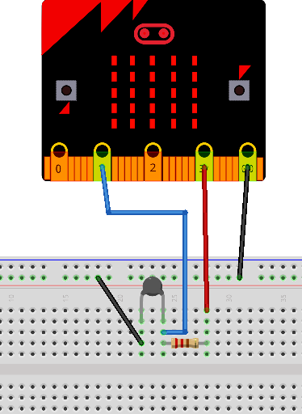
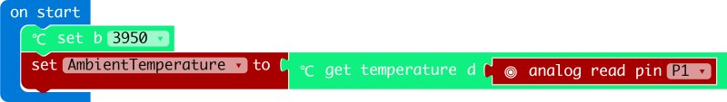

# NTC
makecode NTC Temperature Sensor extension for microbit  

Author: shaoziyang  
Date:   2018.Mar  


## Add extension  

open your microbit makecode project, in Extensions, paste  

https://github.com/teknologishuet/NTC

to search box then search.

## Basic usage  

```
let AmbientTemperature = 0
NTCSenor.set(NTC_B.B3950)
AmbientTemperature = NTCSenor.Temperature(pins.analogReadPin(AnalogPin.P1)) 
```

## Circuit




## API

- **set**(B: NTC_B)  
B-value is a tendency for resistance in temperature change, it maybe 3380 or 3950 here.    

- **Temperature**(adc: number)  
adc is the result of analog input. Function will return temperature in degree Celsius.    

## Demo



## License  

MIT

Copyright (c) 2018, microbit/micropython Chinese community  

## Supported targets  

* for PXT/microbit


[From microbit/micropython Chinese community](http://www.micropython.org.cn) 
